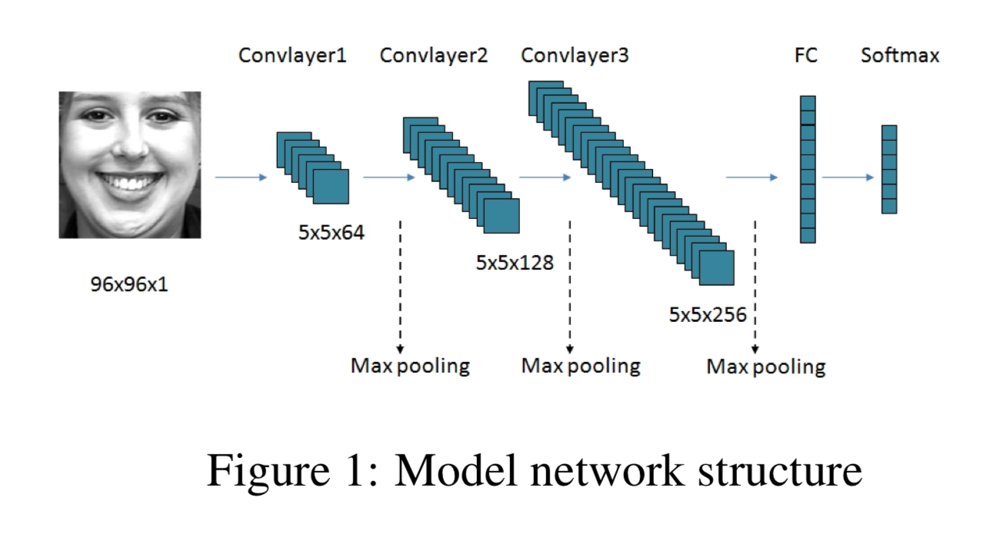

# PyTorch for Computer Vision Example 1 - Convolutional Bebezal Network

**After this notebook, you'll be able to:**
- Use a folder with labels as subfolders as a dataset
- Split train dataset into train, test and val datasets
- Apply transformations in images for data augmentation
- Create a Convolutional Neural Network
- Train and validate your Convolutional Neural Network
- Analyze metrics obtained in training task
- Run inference in test dataset

**TO DO**
- Detect faces in a image, using another CNN
- Train and validate, using only face detected

The architecture of the neural network created in this notebook is based on paper "Facial Expression Recognition Research Based on Deep Learning" Yongpei Zhu, Hongwei Fan, Kehong Yuan1

Link: https://arxiv.org/pdf/1904.09737v1.pdf

